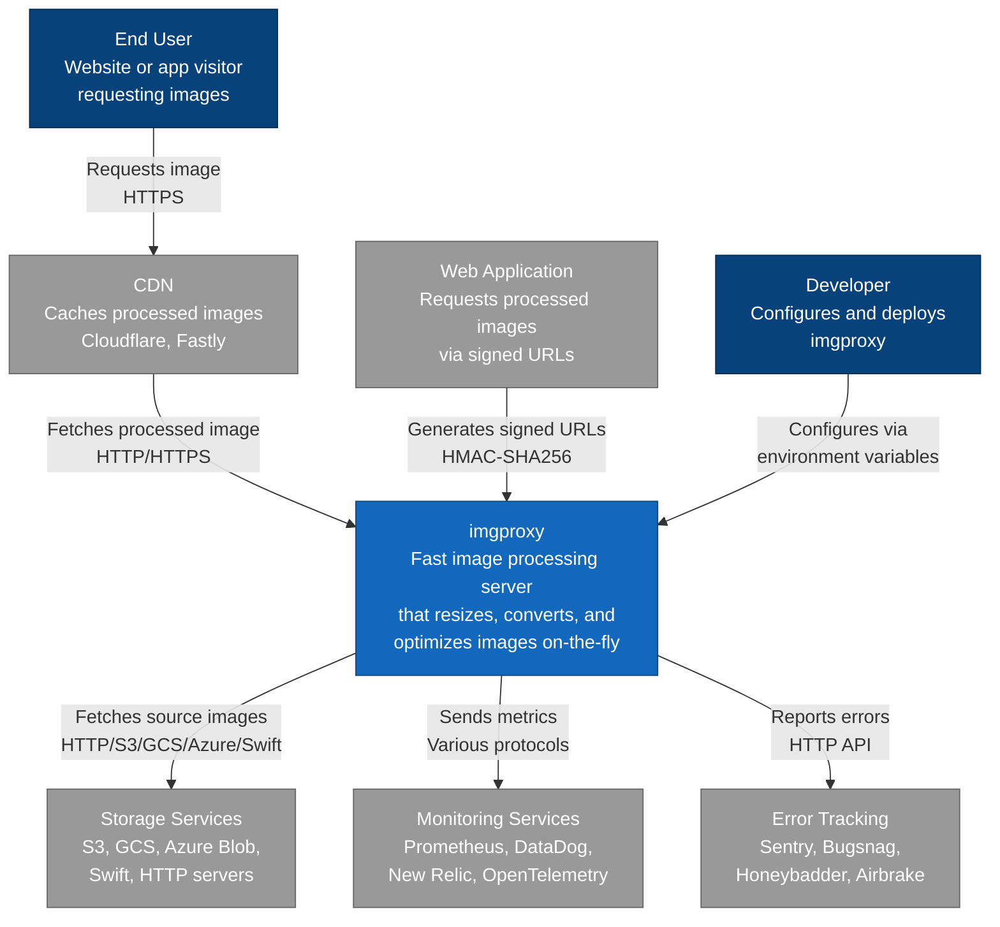
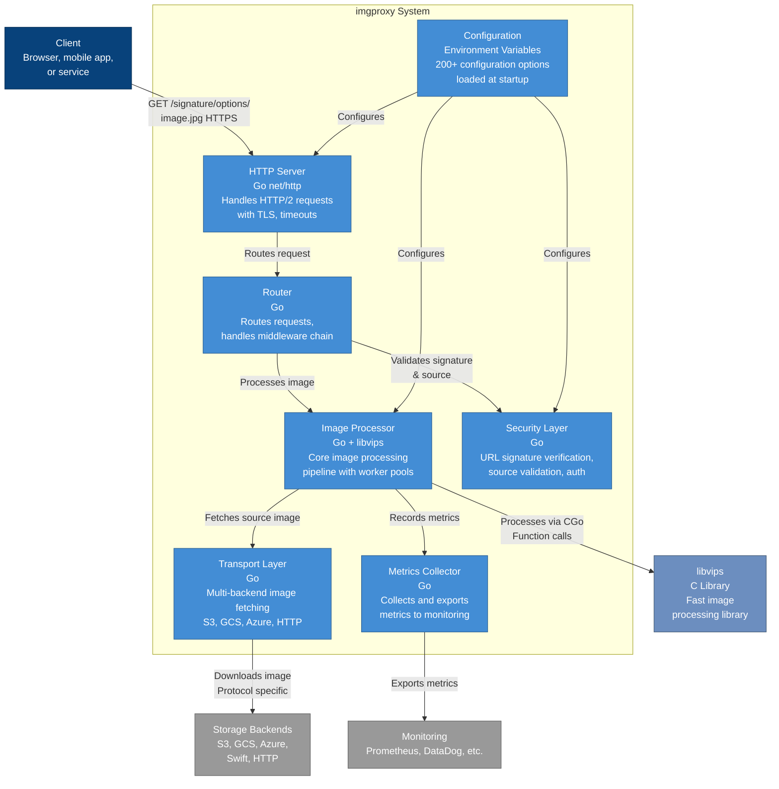
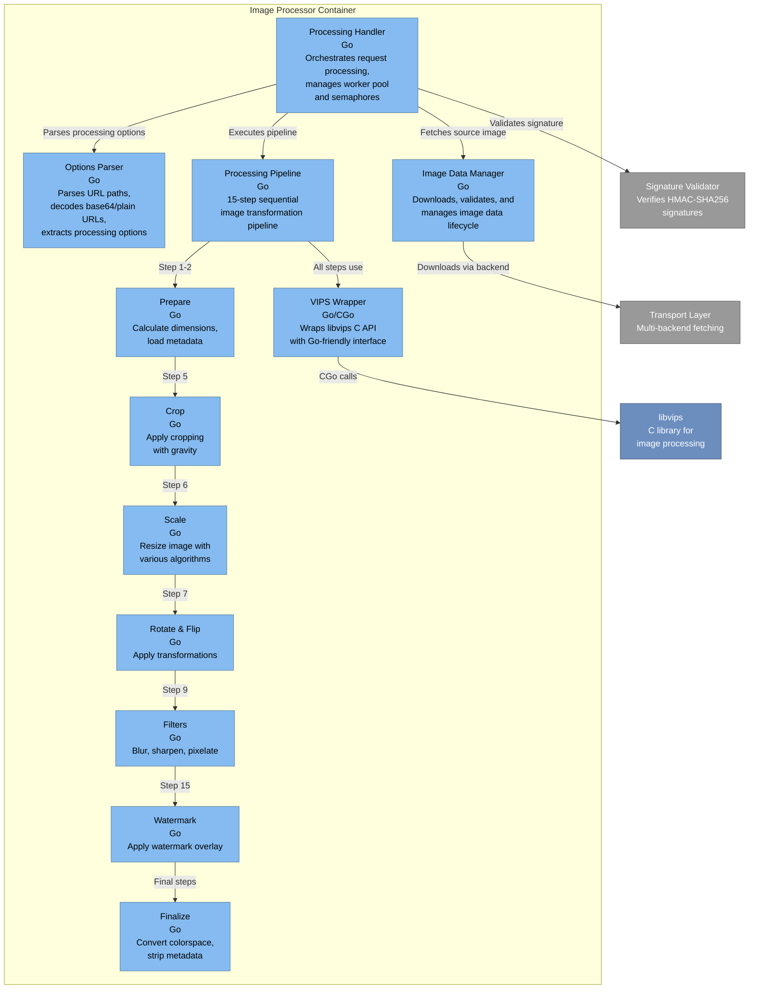
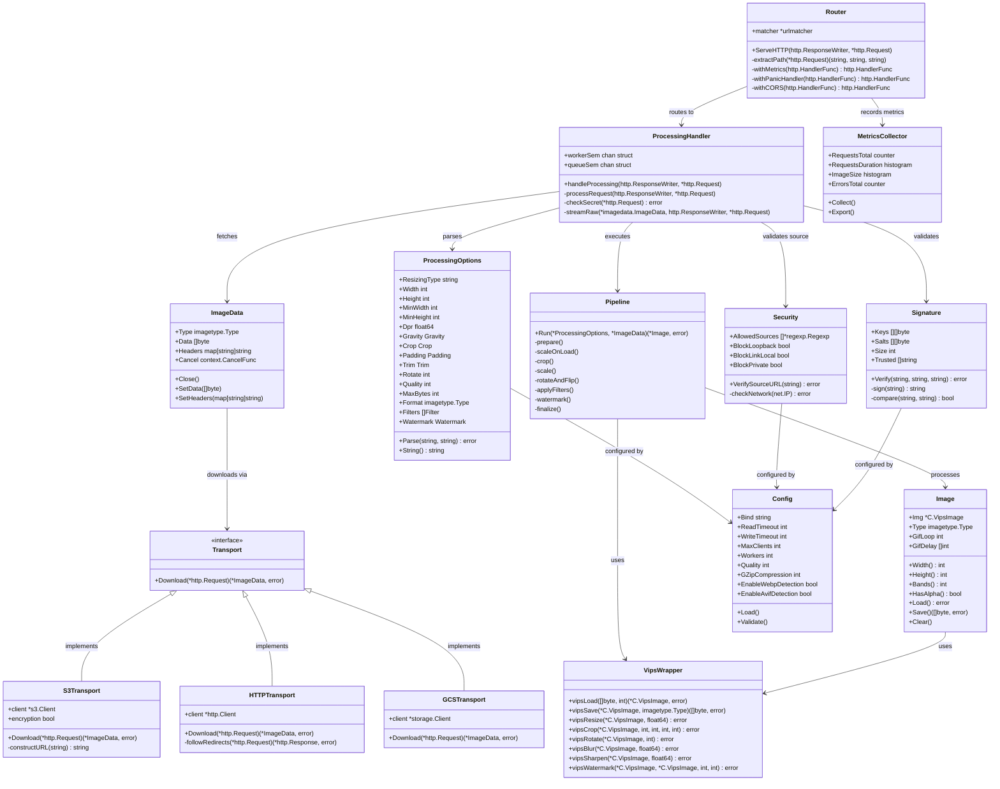
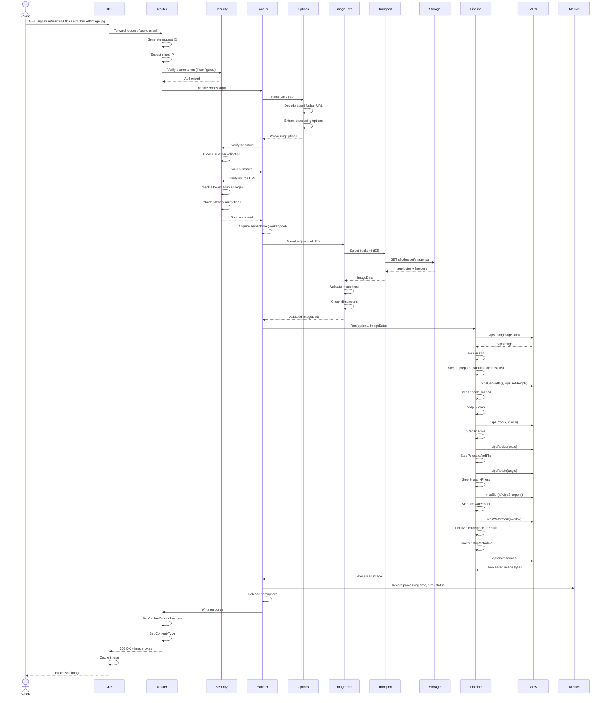
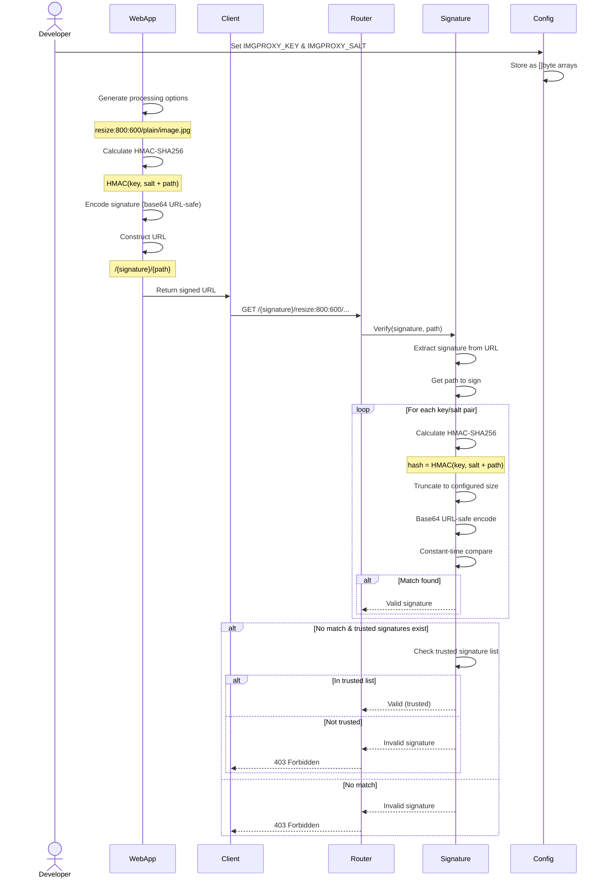
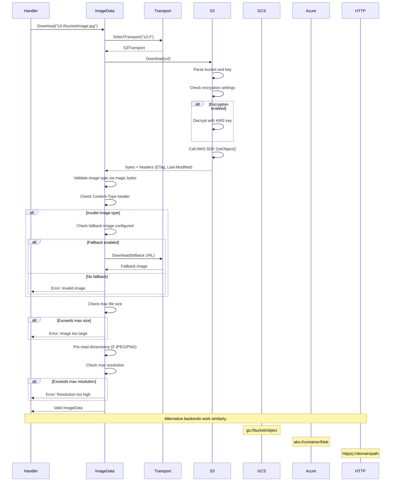
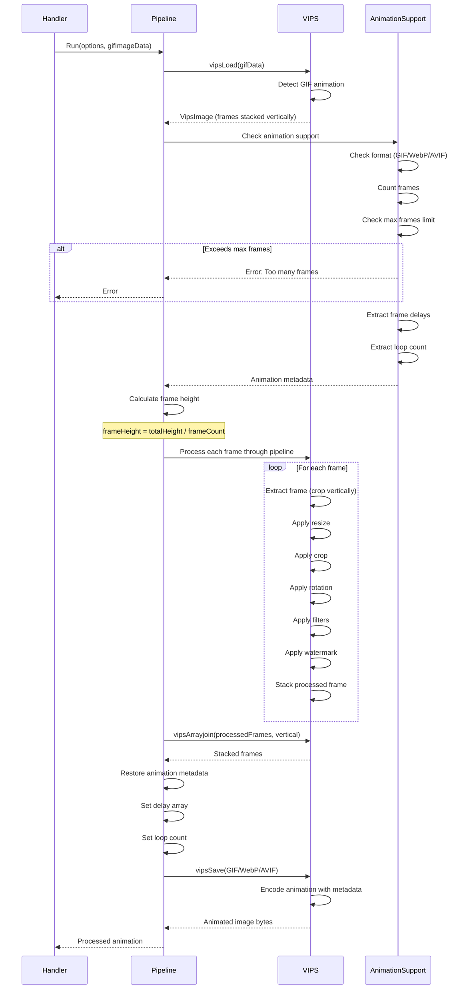
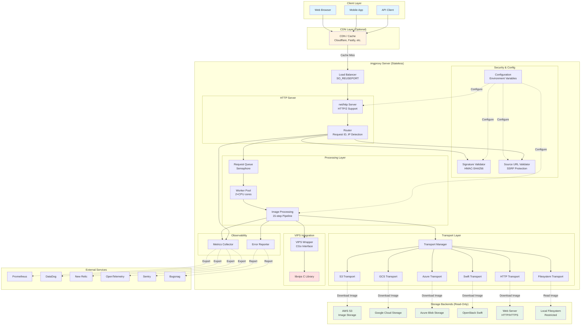
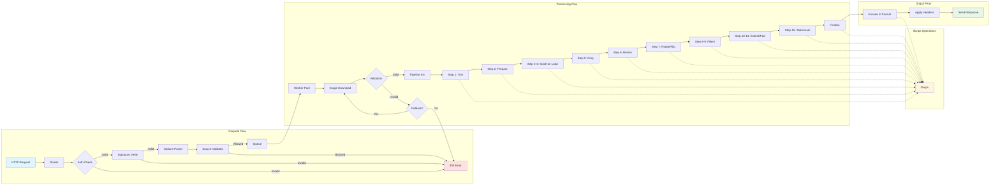

# imgproxy Architecture Documentation

## Overview

imgproxy is a fast and secure standalone server for resizing, processing, and converting images on-the-fly. Built in Go and leveraging libvips, it provides a stateless, high-performance image processing service designed for cloud-native deployments.

---

## C4 Model Diagrams

### Level 1: System Context Diagram



### Level 2: Container Diagram



### Level 3: Component Diagram - Image Processing Pipeline



---

## Class Diagram

### Core Domain Model



---

## Sequence Diagrams

### Sequence 1: Image Processing Request Flow



### Sequence 2: Signature Validation Flow



### Sequence 3: Multi-Backend Image Fetching



### Sequence 4: Animation Processing Flow



---

## Storage & Data Flow Diagram



---

## Component Interaction Architecture



---

## Key Architectural Patterns

### 1. **Stateless Design**
- No database or persistent storage
- Each request is independent
- Configuration via environment variables only
- Enables horizontal scaling without coordination

### 2. **Worker Pool Pattern**
- Semaphore-based concurrency control
- Configurable workers (default: 2×CPU cores)
- Optional request queue to prevent overload
- Per-request goroutine isolation

### 3. **Pipeline Pattern**
- 15-step sequential processing pipeline
- Each step is independent and testable
- Steps can be skipped based on options
- Animation support via frame iteration

### 4. **Transport Abstraction**
- Unified interface for multiple storage backends
- Protocol detection via URL scheme
- Pluggable backend implementations
- Consistent error handling

### 5. **Security-First**
- HMAC-SHA256 signature verification
- SSRF protection (network restriction)
- Image bomb prevention (size/dimension limits)
- Constant-time comparison for auth

### 6. **Observability**
- Multi-platform metrics export
- Request tracing with unique IDs
- Error reporting integrations
- Performance monitoring

---

## Technology Stack

| Layer | Technology |
|-------|-----------|
| **Language** | Go 1.21+ |
| **Image Processing** | libvips 8.13+ (C library) |
| **HTTP Server** | Go net/http with HTTP/2 |
| **Concurrency** | Goroutines + Semaphores |
| **Configuration** | Environment Variables |
| **Storage** | S3, GCS, Azure Blob, Swift, HTTP, Filesystem |
| **Metrics** | Prometheus, DataDog, New Relic, OpenTelemetry, CloudWatch |
| **Error Tracking** | Sentry, Bugsnag, Honeybadger, Airbrake |
| **Deployment** | Docker, Kubernetes, Serverless (AWS Lambda) |

---

## Performance Characteristics

- **Memory Efficiency**: libvips streaming processing
- **CPU Optimization**: GOMAXPROCS tuning, worker pools
- **Network**: HTTP/2, connection pooling, redirect following
- **Caching**: Client-side via Cache-Control, ETag support
- **Scalability**: Horizontal scaling, stateless design
- **Throughput**: High concurrency via goroutines and semaphores

---

## Security Features

1. **URL Signature**: HMAC-SHA256 with key rotation support
2. **Source Validation**: Regex-based URL whitelist
3. **SSRF Protection**: Network restriction (loopback, link-local, private)
4. **Size Limits**: Max file size, max resolution, max animation frames
5. **Auth**: Bearer token support
6. **SVG Sanitization**: XSS protection for SVG images
7. **Image Bombs**: Early validation prevents decompression attacks

---

## Deployment Patterns

### 1. **Containerized (Docker)**
```
docker run -p 8080:8080 -e IMGPROXY_KEY=... darthsim/imgproxy
```

### 2. **Kubernetes**
- StatefulSet not required (stateless)
- HorizontalPodAutoscaler for scaling
- Service mesh compatible

### 3. **Serverless (AWS Lambda)**
- Supports Lambda deployment
- Request ID from Lambda context
- Cold start optimization

### 4. **Behind CDN**
- Cloudflare, Fastly, CloudFront
- Cache processed images
- Reduce origin load

---

This documentation provides a comprehensive architectural overview of imgproxy using C4 model diagrams, class diagrams, sequence diagrams, and data flow visualizations. The system is designed for high performance, security, and scalability in cloud-native environments.
