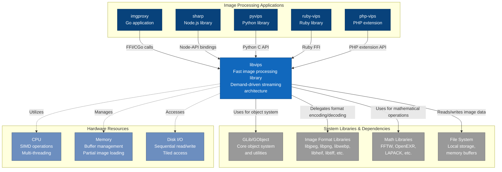
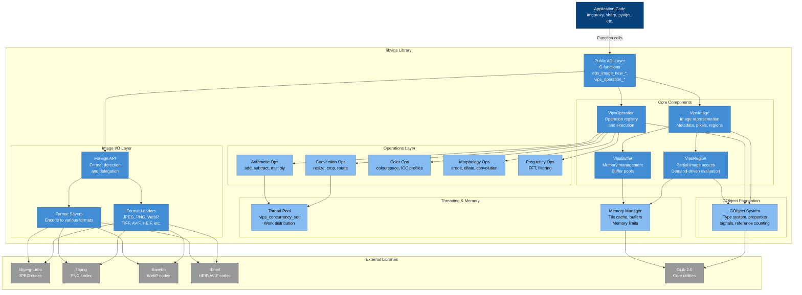
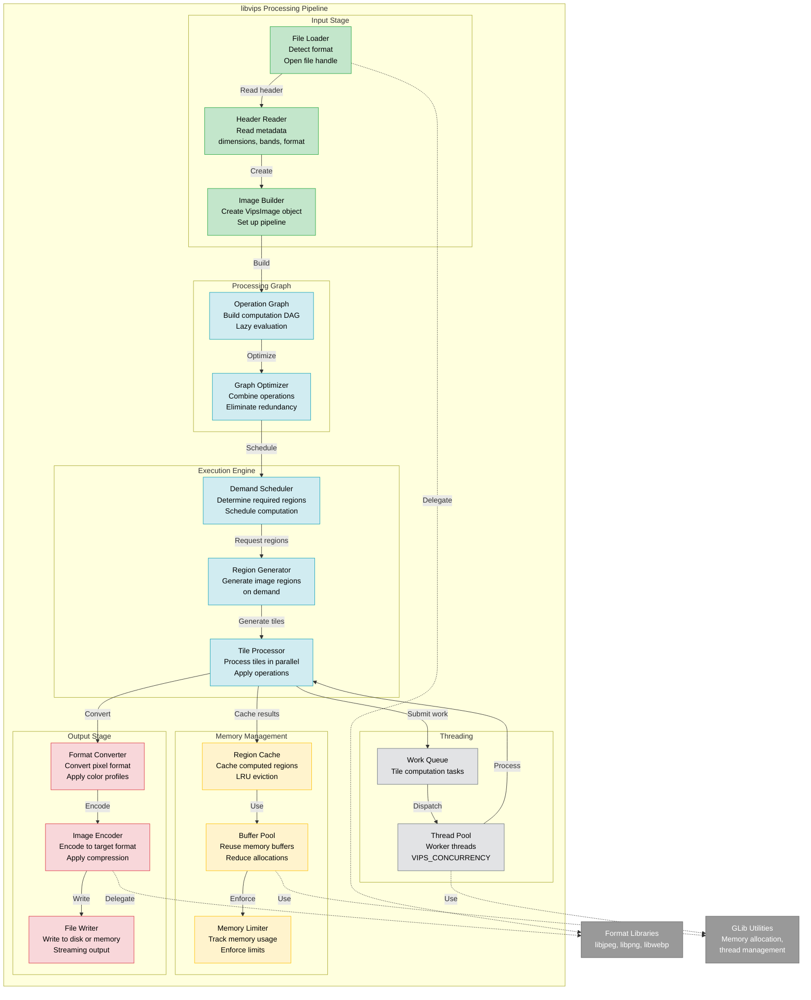
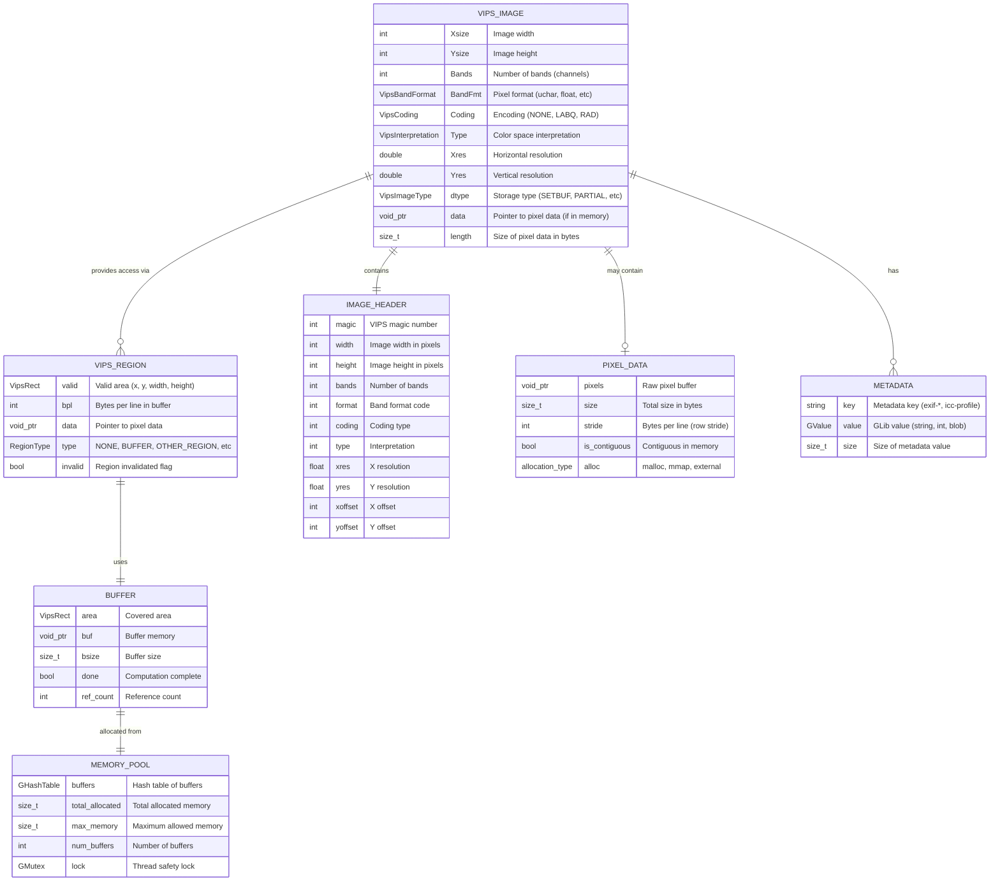
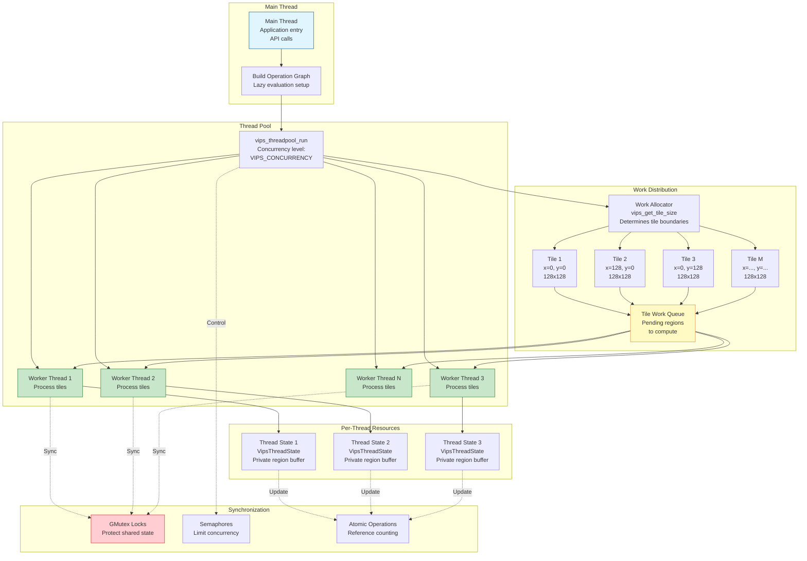

# libvips Architecture Documentation

## Overview

libvips is a fast, memory-efficient image processing library written in C. It uses a demand-driven, streaming architecture that processes images in small regions, making it capable of handling very large images without loading them entirely into memory. It's built on GObject and provides bindings for multiple languages.

---

## C4 Model Diagrams for libvips

### Level 1: System Context Diagram for libvips



### Level 2: Container Diagram for libvips



### Level 3: Component Diagram - Image Processing Pipeline



---

## Class Diagram for libvips

```mermaid
classDiagram
    class GObject {
        <<GLib Base Class>>
        +gint ref_count
        +GData *qdata
        +g_object_ref()
        +g_object_unref()
        +g_object_get_property()
        +g_object_set_property()
    }

    class VipsObject {
        <<Abstract Base>>
        +gboolean constructed
        +gboolean static_object
        +char *nickname
        +char *description
        +vips_object_build()
        +vips_object_print_class()
        +vips_object_sanity()
    }

    class VipsImage {
        +gint Xsize
        +gint Ysize
        +gint Bands
        +VipsBandFormat BandFmt
        +VipsCoding Coding
        +VipsInterpretation Type
        +double Xres
        +double Yres
        +VipsImageType dtype
        +void *data
        +VipsRegion **regions
        +vips_image_new()
        +vips_image_new_from_file()
        +vips_image_new_from_buffer()
        +vips_image_write_to_file()
        +vips_image_get_width()
        +vips_image_get_height()
        +vips_image_wio_input()
        +vips_image_pio_input()
    }

    class VipsRegion {
        +VipsImage *im
        +VipsRect valid
        +RegionType type
        +VipsPel *data
        +int bpl
        +vips_region_new()
        +vips_region_prepare()
        +vips_region_fetch()
        +vips_region_copy()
        +vips_region_position()
    }

    class VipsOperation {
        <<Abstract>>
        +VipsOperationFlags flags
        +gboolean sequential
        +gint64 pixels
        +vips_operation_new()
        +vips_operation_build()
        +vips_call()
        +vips_cache_operation_build()
    }

    class VipsArithmetic {
        <<Arithmetic Operations>>
        +VipsImage *left
        +VipsImage *right
        +VipsImage *out
        +vips_add()
        +vips_subtract()
        +vips_multiply()
        +vips_divide()
        +vips_linear()
    }

    class VipsConversion {
        <<Conversion Operations>>
        +VipsImage *in
        +VipsImage *out
        +vips_resize()
        +vips_crop()
        +vips_embed()
        +vips_extract_area()
        +vips_rot()
        +vips_flip()
    }

    class VipsResample {
        <<Resampling Operations>>
        +VipsImage *in
        +VipsImage *out
        +VipsKernel kernel
        +vips_resize()
        +vips_shrink()
        +vips_reduce()
        +vips_affine()
        +vips_mapim()
    }

    class VipsColour {
        <<Color Operations>>
        +VipsImage *in
        +VipsImage *out
        +VipsInterpretation space
        +vips_colourspace()
        +vips_Lab2XYZ()
        +vips_XYZ2Lab()
        +vips_sRGB2HSV()
        +vips_icc_import()
        +vips_icc_transform()
    }

    class VipsForeign {
        <<Format I/O>>
        +char *filename
        +VipsImage *out
        +vips_foreign_find_load()
        +vips_foreign_find_save()
        +vips_foreign_load()
        +vips_foreign_save()
    }

    class VipsForeignLoad {
        <<Abstract Loader>>
        +VipsImage *out
        +VipsForeignFlags flags
        +gboolean sequential
        +vips_foreign_load_*()
        #header()
        #load()
        #generate()
    }

    class VipsForeignLoadJpeg {
        +char *filename
        +gboolean shrink
        +gboolean autorotate
        +vips_jpegload()
        +vips_jpegload_buffer()
        -vips_foreign_load_jpeg_file()
        -vips_foreign_load_jpeg_buffer()
    }

    class VipsForeignLoadPng {
        +char *filename
        +vips_pngload()
        +vips_pngload_buffer()
        -read_png_header()
        -read_png_image()
    }

    class VipsForeignLoadWebp {
        +char *filename
        +gint page
        +gint n
        +vips_webpload()
        +vips_webpload_buffer()
        -read_webp()
    }

    class VipsForeignSave {
        <<Abstract Saver>>
        +VipsImage *in
        +gint page_height
        +vips_foreign_save_*()
        #write()
    }

    class VipsForeignSaveJpeg {
        +char *filename
        +gint Q
        +gboolean optimize_coding
        +gboolean strip
        +vips_jpegsave()
        +vips_jpegsave_buffer()
    }

    class VipsBuffer {
        +VipsImage *im
        +VipsRect area
        +gboolean done
        +VipsBufferCache *cache
        +VipsPel *buf
        +size_t bsize
        +vips_buffer_new()
        +vips_buffer_unref()
        +vips_buffer_print()
    }

    class VipsThreadState {
        +VipsImage *im
        +VipsRegion *reg
        +VipsRect pos
        +int x
        +int y
        +vips_threadstate_new()
        +vips_get_tile_size()
    }

    class VipsThreadPool {
        +VipsImage *im
        +VipsStartFn start
        +VipsStopFn stop
        +VipsAllocateFn allocate
        +VipsWorkFn work
        +vips_threadpool_run()
        -vips_threadpool_allocate()
        -vips_threadpool_work()
    }

    GObject <|-- VipsObject
    VipsObject <|-- VipsImage
    VipsObject <|-- VipsRegion
    VipsObject <|-- VipsOperation
    VipsOperation <|-- VipsArithmetic
    VipsOperation <|-- VipsConversion
    VipsOperation <|-- VipsResample
    VipsOperation <|-- VipsColour
    VipsOperation <|-- VipsForeign
    VipsForeign <|-- VipsForeignLoad
    VipsForeign <|-- VipsForeignSave
    VipsForeignLoad <|-- VipsForeignLoadJpeg
    VipsForeignLoad <|-- VipsForeignLoadPng
    VipsForeignLoad <|-- VipsForeignLoadWebp
    VipsForeignSave <|-- VipsForeignSaveJpeg

    VipsImage --> VipsRegion : contains many
    VipsRegion --> VipsImage : references
    VipsBuffer --> VipsImage : references
    VipsThreadState --> VipsRegion : uses
    VipsThreadPool --> VipsThreadState : manages
    VipsOperation --> VipsImage : operates on

    class GObject gobject
    class VipsObject,VipsImage,VipsRegion,VipsBuffer base
    class VipsOperation,VipsArithmetic,VipsConversion,VipsResample,VipsColour operations
    class VipsForeign,VipsForeignLoad,VipsForeignLoadJpeg,VipsForeignLoadPng,VipsForeignLoadWebp,VipsForeignSave,VipsForeignSaveJpeg io
    class VipsThreadState,VipsThreadPool threading

    classDef gobject fill:#f9f,stroke:#333,color:#000
    classDef base fill:#bbf,stroke:#333,color:#000
    classDef operations fill:#bfb,stroke:#333,color:#000
    classDef io fill:#ffb,stroke:#333,color:#000
    classDef threading fill:#fbb,stroke:#333,color:#000
```

---

## Data Structure & Memory Architecture Diagram

```mermaid
graph TB
    subgraph "VipsImage Memory Layout"
        subgraph "Header/Metadata"
            ImageHeader[Image Header<br/>Dimensions: Xsize, Ysize<br/>Bands, BandFormat<br/>Coding, Interpretation<br/>Resolution: Xres, Yres]
            ImageMeta[Metadata<br/>EXIF, ICC Profile<br/>XMP, IPTC<br/>Custom fields]
        end

        subgraph "Image Data Storage"
            DataType{Image Type}

            MemoryImage[VIPS_IMAGE_SETBUF<br/>Fully in memory<br/>data pointer to buffer]

            PartialImage[VIPS_IMAGE_PARTIAL<br/>Demand-driven<br/>Generated on request]

            MMapImage[VIPS_IMAGE_MMAPIN<br/>Memory mapped file<br/>Lazy loading]

            OpenFileImage[VIPS_IMAGE_OPENIN<br/>File descriptor<br/>Sequential access]
        end

        ImageHeader --> DataType
        ImageMeta --> DataType
        DataType -->|Type: SETBUF| MemoryImage
        DataType -->|Type: PARTIAL| PartialImage
        DataType -->|Type: MMAPIN| MMapImage
        DataType -->|Type: OPENIN| OpenFileImage
    end

    subgraph "Region-based Access"
        VipsRegion1[VipsRegion<br/>Region 1<br/>valid: x=0,y=0,w=512,h=512<br/>data: pixel buffer pointer<br/>bpl: bytes per line]

        VipsRegion2[VipsRegion<br/>Region 2<br/>valid: x=512,y=0,w=512,h=512<br/>data: pixel buffer pointer<br/>bpl: bytes per line]

        VipsRegion3[VipsRegion<br/>Region 3<br/>valid: x=0,y=512,w=512,h=512<br/>data: pixel buffer pointer<br/>bpl: bytes per line]

        PartialImage -->|Create region| VipsRegion1
        PartialImage -->|Create region| VipsRegion2
        PartialImage -->|Create region| VipsRegion3
    end

    subgraph "Buffer Management"
        BufferPool[Buffer Pool<br/>Cached memory buffers<br/>Size: configurable]

        Buffer1[Buffer 1<br/>Size: 512x512x3<br/>Status: In use]

        Buffer2[Buffer 2<br/>Size: 512x512x3<br/>Status: Free]

        Buffer3[Buffer 3<br/>Size: 512x512x3<br/>Status: Free]

        BufferPool --> Buffer1
        BufferPool --> Buffer2
        BufferPool --> Buffer3

        VipsRegion1 -.->|Uses| Buffer1
    end

    subgraph "Tile Cache"
        TileCache[Tile Cache<br/>LRU eviction<br/>Max memory limit]

        CachedTile1[Tile x=0,y=0<br/>Computed result<br/>Last access: recent]

        CachedTile2[Tile x=512,y=0<br/>Computed result<br/>Last access: old]

        TileCache --> CachedTile1
        TileCache --> CachedTile2

        VipsRegion2 -.->|Cache hit| CachedTile2
    end

    subgraph "Pixel Format Layout"
        PixelLayout[Pixel Data Layout]

        Interleaved[Interleaved<br/>RGBRGBRGB...<br/>Band-interleaved by pixel]

        Planar[Planar<br/>RRR...GGG...BBB...<br/>Band-sequential]

        PixelLayout --> Interleaved
        PixelLayout --> Planar
    end

    subgraph "Operation Pipeline Graph"
        SourceImage[Source Image<br/>VipsImage*<br/>input.jpg]

        ResizeOp[Resize Operation<br/>VipsOperation*<br/>scale: 0.5]

        CropOp[Crop Operation<br/>VipsOperation*<br/>area: 100,100,800,600]

        BlurOp[Blur Operation<br/>VipsOperation*<br/>sigma: 2.0]

        OutputImage[Output Image<br/>VipsImage*<br/>result]

        SourceImage -->|input| ResizeOp
        ResizeOp -->|output| CropOp
        CropOp -->|output| BlurOp
        BlurOp -->|output| OutputImage
    end

    subgraph "Memory Tracking"
        MemStats[Memory Statistics<br/>vips_tracked_get_mem()<br/>vips_tracked_get_allocs()]

        MemLimit[Memory Limit<br/>VIPS_MAX_MEMORY<br/>Default: 100MB]

        MemStats -.->|Enforce| MemLimit
    end

    style ImageHeader fill:#d4edda,stroke:#28a745
    style ImageMeta fill:#d4edda,stroke:#28a745
    style MemoryImage fill:#cce5ff,stroke:#004085
    style PartialImage fill:#fff3cd,stroke:#856404
    style MMapImage fill:#cce5ff,stroke:#004085
    style OpenFileImage fill:#cce5ff,stroke:#004085
    style VipsRegion1 fill:#f8d7da,stroke:#721c24
    style VipsRegion2 fill:#f8d7da,stroke:#721c24
    style VipsRegion3 fill:#f8d7da,stroke:#721c24
    style BufferPool fill:#d1ecf1,stroke:#0c5460
    style TileCache fill:#e2e3e5,stroke:#383d41
    style SourceImage fill:#c3e6cb,stroke:#155724
    style OutputImage fill:#c3e6cb,stroke:#155724
```

---

## Memory Management Flow Diagram

```mermaid
graph LR
    subgraph "Application Request"
        App[Application<br/>requests pixel region<br/>x=1000, y=1000, w=512, h=512]
    end

    subgraph "Region Preparation"
        PrepareRegion[vips_region_prepare<br/>Calculate required<br/>input regions]

        CheckCache{Region<br/>in cache?}

        CacheHit[Return cached data<br/>Update LRU]

        CacheMiss[Compute region<br/>Allocate buffer]
    end

    subgraph "Computation"
        TraceBack[Trace computation graph<br/>Find source regions needed]

        RequestInput[Request input regions<br/>from parent operations]

        AllocBuffer[Allocate output buffer<br/>from buffer pool]

        Execute[Execute operation<br/>on input data]

        StoreCache[Store result in cache<br/>if cacheable]
    end

    subgraph "Buffer Pool Management"
        CheckPool{Buffer<br/>available?}

        ReuseBuffer[Reuse existing buffer<br/>from pool]

        AllocNew[Allocate new buffer<br/>Track memory]

        CheckLimit{Exceeds<br/>memory limit?}

        EvictOld[Evict old buffers<br/>Free memory]

        OOMError[Out of memory error<br/>Return error]
    end

    subgraph "Result Delivery"
        ReturnData[Return pixel data<br/>to application]
    end

    App --> PrepareRegion
    PrepareRegion --> CheckCache
    CheckCache -->|Hit| CacheHit
    CheckCache -->|Miss| CacheMiss
    CacheHit --> ReturnData
    CacheMiss --> TraceBack
    TraceBack --> RequestInput
    RequestInput --> AllocBuffer
    AllocBuffer --> CheckPool
    CheckPool -->|Available| ReuseBuffer
    CheckPool -->|Not available| AllocNew
    AllocNew --> CheckLimit
    CheckLimit -->|OK| Execute
    CheckLimit -->|Exceeds| EvictOld
    EvictOld --> CheckLimit
    CheckLimit -->|Still exceeds| OOMError
    ReuseBuffer --> Execute
    Execute --> StoreCache
    StoreCache --> ReturnData

    style App fill:#e1f5ff,stroke:#01579b
    style CacheHit fill:#c8e6c9,stroke:#2e7d32
    style Execute fill:#fff9c4,stroke:#f57f17
    style OOMError fill:#ffcdd2,stroke:#c62828
    style ReturnData fill:#c8e6c9,stroke:#2e7d32
```



---

## Pixel Data Storage Schema



---

## Supported Image Formats & Codecs

```mermaid
graph TB
    subgraph "Input Formats (Loaders)"
        JPEG[JPEG / JPG<br/>libjpeg-turbo<br/>Fast baseline & progressive]
        PNG[PNG<br/>libpng / libspng<br/>All bit depths, interlaced]
        WebP[WebP<br/>libwebp<br/>Lossy & lossless, animation]
        TIFF[TIFF<br/>libtiff<br/>Multipage, tiled, BigTIFF]
        HEIF[HEIF / HEIC<br/>libheif<br/>HEVC compression]
        AVIF[AVIF<br/>libheif<br/>AV1 compression]
        GIF[GIF<br/>giflib<br/>Animation support]
        SVG[SVG<br/>librsvg<br/>Vector graphics]
        PDF[PDF<br/>poppler<br/>Rasterization]
        RAW[Camera RAW<br/>libraw<br/>CR2, NEF, DNG, etc.]
        FITS[FITS<br/>cfitsio<br/>Scientific images]
        OpenEXR[OpenEXR<br/>IlmImlib<br/>HDR images]
        PPM[PPM/PGM/PBM<br/>Native<br/>Netpbm formats]
        VIPS[VIPS Native<br/>Native<br/>Fast save/load]
    end

    subgraph "Output Formats (Savers)"
        JPEG_OUT[JPEG<br/>Quality, progressive,<br/>optimize coding]
        PNG_OUT[PNG<br/>Compression level,<br/>interlacing, palette]
        WebP_OUT[WebP<br/>Quality, lossless,<br/>near lossless]
        TIFF_OUT[TIFF<br/>Compression (LZW, JPEG),<br/>tiling, pyramids]
        HEIF_OUT[HEIF<br/>Quality, compression]
        AVIF_OUT[AVIF<br/>Quality, speed,<br/>lossless]
        GIF_OUT[GIF<br/>Dithering,<br/>animation]
        JXL[JPEG XL<br/>libjxl<br/>Next-gen format]
        VIPS_OUT[VIPS Native<br/>Zero-copy<br/>intermediate format]
    end

    subgraph "libvips Format System"
        FormatDetect[Format Detection<br/>Magic bytes, extension]
        LoaderRegistry[Loader Registry<br/>vips_foreign_find_load]
        SaverRegistry[Saver Registry<br/>vips_foreign_find_save]
    end

    JPEG --> LoaderRegistry
    PNG --> LoaderRegistry
    WebP --> LoaderRegistry
    TIFF --> LoaderRegistry
    HEIF --> LoaderRegistry
    AVIF --> LoaderRegistry
    GIF --> LoaderRegistry
    SVG --> LoaderRegistry
    PDF --> LoaderRegistry
    RAW --> LoaderRegistry
    FITS --> LoaderRegistry
    OpenEXR --> LoaderRegistry
    PPM --> LoaderRegistry
    VIPS --> LoaderRegistry

    LoaderRegistry --> FormatDetect
    FormatDetect --> SaverRegistry

    SaverRegistry --> JPEG_OUT
    SaverRegistry --> PNG_OUT
    SaverRegistry --> WebP_OUT
    SaverRegistry --> TIFF_OUT
    SaverRegistry --> HEIF_OUT
    SaverRegistry --> AVIF_OUT
    SaverRegistry --> GIF_OUT
    SaverRegistry --> JXL
    SaverRegistry --> VIPS_OUT

    style JPEG fill:#d4edda,stroke:#28a745
    style PNG fill:#d4edda,stroke:#28a745
    style WebP fill:#d4edda,stroke:#28a745
    style AVIF fill:#d1ecf1,stroke:#17a2b8
    style HEIF fill:#d1ecf1,stroke:#17a2b8
    style FormatDetect fill:#fff3cd,stroke:#ffc107
```

---

## Threading Architecture



---

## Performance Characteristics

| Aspect | Implementation | Benefit |
|--------|----------------|---------|
| **Memory Efficiency** | Streaming, region-based processing | Process images larger than RAM |
| **CPU Utilization** | Thread pool, tile-level parallelism | Multi-core speedup |
| **Cache Optimization** | Tile cache, buffer pool | Reduce redundant computation |
| **I/O Optimization** | Memory mapping, sequential access | Minimize disk I/O overhead |
| **Pipeline Fusion** | Operation graph optimization | Combine operations, reduce passes |
| **SIMD** | ORC, hand-coded SIMD (ARM NEON, x86 SSE) | Vectorized operations |
| **Format Libraries** | Delegates to specialized codecs | Optimal encoding/decoding |
| **Lazy Evaluation** | Demand-driven computation | Only compute what's needed |

---

## Key Design Patterns

### 1. **Demand-Driven Evaluation (Pull Model)**
- Operations build a computation graph without executing
- Evaluation happens when output is requested
- Only required regions are computed

### 2. **Region-Based Processing**
- Images divided into small tiles/regions
- Each region processed independently
- Enables parallel processing and memory efficiency

### 3. **Object-Oriented C (via GObject)**
- Type system, inheritance, polymorphism
- Reference counting for memory management
- Property system for configuration

### 4. **Pipeline Optimization**
- Graph optimization combines operations
- Eliminates redundant computation
- Reduces memory bandwidth

### 5. **Thread Pool Pattern**
- Fixed number of worker threads
- Work queue for tile processing
- Per-thread state for safety

### 6. **Buffer Pool**
- Reuse memory buffers
- Reduce allocation overhead
- Configurable memory limits

---

## Configuration Options

| Environment Variable | Purpose | Default |
|---------------------|---------|---------|
| `VIPS_CONCURRENCY` | Number of worker threads | Number of CPU cores |
| `VIPS_MAX_MEMORY` | Maximum memory for cache | 100 MB |
| `VIPS_DISC_THRESHOLD` | Threshold to use disk temp files | 100 MB |
| `VIPS_NOVECTOR` | Disable SIMD vectorization | Enabled |
| `VIPS_STALL` | Stall on first warning/error | Disabled |
| `VIPS_PROGRESS` | Enable progress reporting | Disabled |

---

## Integration Points

### C API
```c
VipsImage *image = vips_image_new_from_file("input.jpg", NULL);
vips_resize(image, &output, 0.5, NULL);
vips_image_write_to_file(output, "output.jpg", NULL);
```

### Go (via CGo)
```go
C.vips_resize(image.VipsImage, &out, C.double(scale), nil)
```

### Python (pyvips)
```python
image = pyvips.Image.new_from_file('input.jpg')
image = image.resize(0.5)
image.write_to_file('output.jpg')
```

### Node.js (sharp)
```javascript
sharp('input.jpg')
  .resize(800, 600)
  .toFile('output.jpg');
```

---

This documentation provides a comprehensive architectural view of libvips, showing its internal structure, memory management, threading model, and data flow patterns. The library's design prioritizes memory efficiency, performance, and scalability for high-volume image processing workloads.
